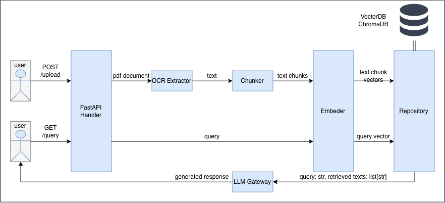
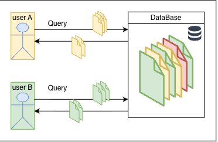

# PDF RAG Service Proof of Concept

A proof of concept, multi-tenant RAG service in python where users can upload PDF files, have the information chunked, embedded and stored in an in-memory vector database; query their documents and receive a coherent answer generated by a local LLM based on the retrieved context. 

## Features:

- OCR for parsing documents, so it works with scanned PDFs.
- Multi-tenant storage & retrieval: The service implements strict multi-tennat separation via metadata filtering. No tenant can access documents and document fragments from other tenants.
- LLMs and providers of user's choice: The service implements a llm interface so the user can pick their preferred llm model or provider


## Project Architecture Overview

### graph of architecture



### graph explaining multi-tenant separation architecture



### Justifications of technology stack selection

Guiding principles for design choices:   

- Convenience: open source packages, local model, in-memory storage, no data send externally  
- Proof of concept: make something work as efficient as possible; No premature optimization; stays with a familiar package if it gets the job done; standard solutions first
- Programming against abstraction: Making the structure as robust as possible in limited time; allowing future improvements/swapping to other model or packages without massive rewriting.

Specifically: 

- REST API framework: FastAPI
  - Easy to use and learn; fast to run;
  - Typing support
- OCR engine: Tesseract OCR
  - Easy to use; It gets the job done; 
  - Light weight; standalone; EasyOCR for example relies on PyTorch and TorchVision and therefore not chosen
  - Can easily swap for other OCR programs
- Chunking Strategy: Simple chunking
  - Proof of concept, simplest method: fixed number of words chunking with overlap
  - Semantic and structure aware chunking is not trivial, and requires better research
  - Wrote abstract class Chunker for swapping for better chunking methods in the future
- Embedder: all-miniLM-L6-v2
  - Previous experience with the mdoel; It gets the job done;
  - Lightweight (not a lot of parameters with OKish perforamnces); Runs locally; Popular model; 
  - Wrote abstract class Embedder for swapping for better embedder models
- Vector DB: ChromaDB
  - open-source, fast to learn and use
  - in-memory storage for convenience; good enough for small tasks
  - Wrote repository class for swapping for other VectorDB and isolate the rest of the code from VectorDB specifics
- LLM Interface: LiteLLM with ollama/llama3.2 backend
  - LiteLLM is compatible with most available LLMs and LLM providers. Easy to swap for other LLM provider or model
  - Ollama/llama3.2: open source provider, open source model, can run locally


## Installation & Usage

### Set up environment

```bash
conda env create --name venv --file=environment.yaml
```


### Run FastAPI

```bash
fastapi dev
```


### Upload Service

`user_id` with token `user_token` uploads a file at `path/to/file.pdf`. 

If using CLI

```bash
curl -X POST 'http://localhost:8000/upload/' \
-F 'file=@path/to/file.pdf' \
-F 'tenant_id="user_id"' \
-F 'tenant_token="user_token"'
```

If using Python

```python
import requests

with open("path/to/file.pdf", "rb") as f:
    requests.post(
        "http://127.0.0.1:8000/upload/", 
        files={"file": f}, 
        data={"tenant_id": "user_id", "tenant_token": "user_token"})
```

Example output: 

```json
{
    "file":"file.pdf",
    "num_chunks": 10,
    "saved_records": 22,
}
```


### Query Service

`user_id` with token `user_token` queries user uploaded files with a question `"example question?"`

If using CLI

```bash
curl -X POST http://localhost:8000/question/ \
-H "Content-Type: application/json" \
-d '{"question": "example question?", "tenant_id": "user_id", "tenant_token": "user_token"}'
```

If using Python

```python
import requests

requests.post(
        "http://127.0.0.1:8000/question/", 
        json={
            "question": "example_question?", 
            "tenant_id": "user_id", 
            "tenant_token": "user_token"
            }
        )
```

Example output: 

```json
{
    "question": "What is the weather today?",
    "answer": "I'm not aware of any information about the weather provided in the context. "
}
```

```json
{
    "question": "What is the company name?",
    "answer": "The company is Northstar Ltd."
}
```


## Project Overview

```bash
.
├── README.md               # Documentation
├── app_demo.ipynb          # Demo notebook for app usage 
├── assets/                 # Document Images              
├── data/                   # Data directory
├── environment.yaml        # Environment Setup
├── main.py                 # Script for FastAPI services
├── pyproject.toml          # Dependencies
├── src/                    # Source code
│   └── pdf_rag_poc/
│       ├── demo.py         # Demo script component usage
│       ├── chunker/        # Components to chunk text
│       ├── data_structure/ # Components for data structure
│       ├── embedder/       # Components to embed text
│       ├── llm_gateway/    # Components to communicate with llm service
│       ├── parser/         # Components to parse PDF
│       └── repository/     # Components to communicate with database
└── tests/                  # Test functions
```

